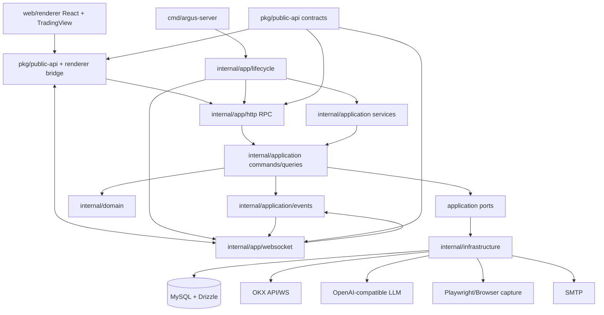

# 01. 模块结构规划

## 背景与目标

Argus 当前是一个 TypeScript 单仓库应用，运行形态为 Node HTTP/WebSocket 服务端 + Vite/React Web 前端。源码集中在 `src/server`、`src/node`、`src/renderer`、`src/shared`：

- `src/server/index.ts` 同时承担进程启动、Express 应用、HTTP RPC、WebSocket 广播、静态资源托管、后台采样任务和关停流程。
- `src/node` 同时包含领域逻辑、外部服务适配、数据访问、调度器、运行时事件总线和基础设施能力。
- `src/renderer` 包含 Vite 前端、React UI、TradingView 截图客户端以及 `window.argus` bridge。
- `src/shared` 存放前后端共享常量和展示字段。

本次规划的核心目标是：在保持公开 HTTP/WS/`window.argus` 契约兼容的前提下，拆清表现层、应用层、领域层、数据层与基础设施层，为后续功能演进和团队协作提供稳定边界。

## 建议目录结构

```text
.
├── api/
│   ├── openapi.yaml
│   └── asyncapi.yaml
├── cmd/
│   └── argus-server/
│       └── main.ts
├── docs/
│   └── refactor-plan/
├── internal/
│   ├── app/
│   │   ├── http/
│   │   │   ├── create-app.ts
│   │   │   ├── rpc-router.ts
│   │   │   ├── middleware/
│   │   │   └── handlers/
│   │   ├── websocket/
│   │   │   ├── ws-server.ts
│   │   │   ├── channels.ts
│   │   │   └── client-registry.ts
│   │   └── lifecycle/
│   │       ├── bootstrap.ts
│   │       └── shutdown.ts
│   ├── domain/
│   │   ├── config/
│   │   ├── market/
│   │   ├── strategy/
│   │   ├── agent/
│   │   ├── dashboard/
│   │   └── capture/
│   ├── application/
│   │   ├── services/
│   │   ├── commands/
│   │   ├── queries/
│   │   └── events/
│   ├── infrastructure/
│   │   ├── db/
│   │   ├── okx/
│   │   ├── llm/
│   │   ├── email/
│   │   ├── browser/
│   │   ├── logging/
│   │   ├── metrics/
│   │   └── config/
│   └── pkg/
│       ├── errors/
│       ├── result/
│       ├── pagination/
│       ├── time/
│       └── validation/
├── pkg/
│   └── public-api/
│       ├── rpc-contract.ts
│       ├── ws-contract.ts
│       ├── argus-bridge-contract.ts
│       └── types.ts
├── web/
│   └── renderer/
│       ├── index.html
│       └── src/
├── drizzle/
├── scripts/
└── tests/
    ├── contract/
    ├── integration/
    └── unit/
```

> 说明：上述结构借鉴 Go 项目常见的 `cmd/internal/pkg/api` 分层命名，但落地为 TypeScript 工程。`internal` 表示应用私有实现，`pkg/public-api` 表示可被前端、测试或未来外部 SDK 复用的稳定契约。

## 分层职责

| 层级 | 目标职责 | 不应承担的职责 | 当前主要迁移来源 |
|------|----------|----------------|------------------|
| `cmd/argus-server` | 读取环境、调用 bootstrap、启动进程 | Express 路由、业务逻辑、数据库查询 | `src/server/index.ts` 的 `main()` |
| `internal/app/http` | HTTP 中间件、RPC 路由、兼容响应 envelope、静态资源托管 | OKX/LLM/DB 细节 | `src/server/index.ts` 的 `createApp` 与 `rpcHandlers` |
| `internal/app/websocket` | WS 连接生命周期、客户端角色注册、频道广播、入站消息解析 | 领域事件生成、截图业务规则 | `src/server/index.ts`、`chart-capture-browser-bridge.ts` |
| `internal/application` | 编排用例：保存配置、切换市场、获取 Dashboard、执行 Agent 回合 | 具体 ORM、HTTP response、UI 状态 | `src/node/*-service.ts`、store/handler 逻辑 |
| `internal/domain` | 领域模型、领域规则、状态流转和纯函数 | 外部 API 调用、文件/网络 IO | `strategy-fields.ts`、`market.ts`、Agent/策略规则 |
| `internal/infrastructure` | MySQL/Drizzle、OKX、OpenAI、SMTP、Playwright、日志指标实现 | 跨领域业务编排 | `src/node/db`、`okx-perp.ts`、`llm.ts`、`headless-browser-service.ts` |
| `internal/pkg` | 私有通用工具：错误、分页、时间、校验、Result 类型 | 具体业务概念 | 多处重复工具与隐式模式 |
| `pkg/public-api` | 公开 RPC/WS/bridge 类型、错误码、分页协议 | 私有实现、DB schema | `argus-bridge.ts` 与 `src/server/index.ts` 中的契约 |
| `web/renderer` | React UI、TradingView 交互、浏览器 bridge 消费 | 业务规则和数据访问 | `src/renderer` |
| `api` | OpenAPI/AsyncAPI 文档与生成输入 | 运行时代码 | 新增 |
| `tests` | 契约、集成、单元测试 | 生产代码 | 新增 |

## 模块依赖图



## 依赖规则

1. `cmd` 只能依赖 `internal/app/lifecycle` 与配置加载，不直接依赖领域或基础设施细节。
2. `internal/app` 只能将协议对象转换为应用层 command/query，并负责协议兼容。
3. `internal/application` 可以依赖 `internal/domain` 和抽象端口，不直接依赖 Express、WebSocket、React。
4. `internal/domain` 不依赖 `internal/infrastructure`、HTTP、数据库、环境变量或全局单例。
5. `internal/infrastructure` 实现应用层端口，可依赖第三方 SDK、Drizzle、mysql2、Playwright、nodemailer。
6. `pkg/public-api` 只包含稳定类型和契约，不依赖 `internal`。
7. `web/renderer` 只通过 `pkg/public-api` 和 bridge 访问后端，不导入 `internal`。
8. 数据库迁移仍位于 `drizzle/`，但 schema 源文件迁移到 `internal/infrastructure/db/schema.ts` 后需同步 `drizzle.config.ts`。

## 当前文件迁移建议

| 当前路径 | 建议目标 | 备注 |
|----------|----------|------|
| `src/server/index.ts` | `cmd/argus-server/main.ts`、`internal/app/http/*`、`internal/app/websocket/*`、`internal/app/lifecycle/*` | 先拆纯函数和 handler，再拆启动入口 |
| `src/node/db/*` | `internal/infrastructure/db/*` | 保持启动自动迁移行为；迁移前补集成测试 |
| `src/node/app-config.ts` | `internal/domain/config` + `internal/infrastructure/config` + `internal/application/services/config-service.ts` | 区分配置模型、持久化和保存用例 |
| `src/node/prompt-strategies-store.ts` | `internal/domain/strategy` + `internal/infrastructure/db/repositories` | CRUD 与排序规则需加测试 |
| `src/node/crypto-scheduler.ts` | `internal/application/services/market-scheduler.ts` + `internal/infrastructure/okx/ws-client.ts` | 保持收盘任务串行语义 |
| `src/node/bar-close.ts` | `internal/application/services/bar-close-agent-service.ts` + `internal/domain/agent` | 先提取纯格式化和 prompt 构建函数 |
| `src/node/okx-perp.ts` | `internal/infrastructure/okx/*` + `internal/domain/market` | 统一错误、重试、限流与日志 |
| `src/node/llm.ts` | `internal/infrastructure/llm` + `internal/domain/agent` | 区分 OpenAI 客户端与 Agent 决策模型 |
| `src/node/chart-capture-browser-bridge.ts` | `internal/application/services/capture-service.ts` + `internal/app/websocket` | 保持 `request-chart-capture` 频道兼容 |
| `src/node/headless-browser-service.ts` | `internal/infrastructure/browser/headless-capture.ts` | 与 Playwright 生命周期隔离 |
| `src/node/runtime-bus.ts` | `internal/application/events/event-bus.ts` | 强类型频道与 payload |
| `src/shared/*` | `pkg/public-api` 或 `internal/domain` | 前后端都用的类型进 public-api，只服务内部的进 domain |
| `src/renderer` | `web/renderer` | 需同步 Vite root、tsconfig paths 和构建脚本 |

## 兼容性边界

必须保持兼容：

- `POST /api/rpc` 端点路径、请求 `{ method, args }`、响应 `{ ok, result?, error? }` 的外部形态。
- 现有 RPC method 名称与参数顺序，包括 `chartCaptureTest` 兼容别名。
- `/ws` 路径、服务端推送 `{ channel, payload }` envelope、客户端上报 `register-client` 与 `chart-capture-result`。
- `window.argus` 暴露的方法名与返回 Promise 的行为。
- MySQL 数据库表名、字段名、现有迁移历史。

允许内部不兼容：

- `src/node` 内部模块拆分、函数签名和依赖注入方式。
- 领域模型命名、repository/service 边界。
- 日志、错误、指标实现方式。

## 迁移原则

1. **先契约后实现**：先沉淀 `pkg/public-api` 类型和契约测试，再移动实现文件。
2. **先外壳后核心**：先拆 `src/server/index.ts` 的 HTTP/WS/lifecycle 外壳，再拆复杂业务链路。
3. **按领域纵切**：以 config、strategy、dashboard、capture、agent、market 为单位迁移，避免一次性大搬家。
4. **保留适配层**：迁移过程中可在旧路径保留 re-export 或 thin adapter，确保每步提交可构建。
5. **生成物不纳入重构评审**：`dist`、`dist-server` 视为构建产物，不作为源码迁移目标。
