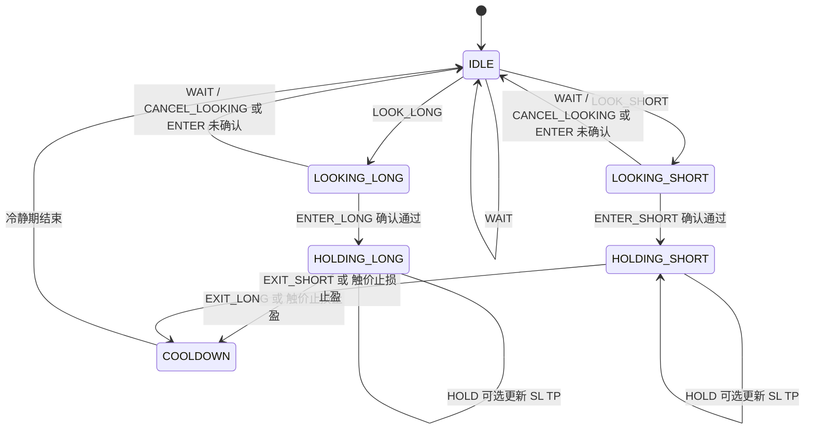

# Argus 项目中的状态机

本文档梳理仓库内**由代码显式维护**的有限状态机及其与 LLM、前端的衔接。

## 结论概览

| 名称 | 实现位置 | 说明 |
|------|----------|------|
| **交易纪律状态机** | `src/node/trading-state.js` | 唯一完整 FSM：按「品种 + K 线周期」分桶，在内存中维护模拟交易纪律状态 |

未发现使用 XState、自定义 `createMachine` 等第三方状态机库；其余模块（如 `src/node/llm-context.js`）为**对话消息存储**，按 key 分桶，**不是**状态机。

---

## 1. 交易纪律状态机

### 1.1 职责

- 在每根 K 线收盘流程中，与 LLM 输出的结构化 `intent` 配合，**约束**何时可观望、观察方向、入场、持仓或离场。
- 在 **HOLDING_*** 状态下，根据当根 K 线的 high/low 与止损/止盈价，可**先于 LLM** 触发硬止损/硬止盈，并进入冷静期。
- 状态按 **`conversationKey`** 隔离：`品种|周期`（与 `src/node/llm-context.js` 中的 `conversationKey` 一致），见 `src/node/bar-close.js`。

### 1.2 状态（`TradingState`）

| 常量 | 含义（界面文案见渲染层） |
|------|--------------------------|
| `IDLE` | 空仓观望 |
| `LOOKING_LONG` | 观察做多 |
| `LOOKING_SHORT` | 观察做空 |
| `HOLDING_LONG` | 模拟持多 |
| `HOLDING_SHORT` | 模拟持空 |
| `COOLDOWN` | 冷静期（硬止损/硬止盈或 LLM 主动平仓后进入） |

渲染层中文标签定义在 `src/renderer/src/argus-renderer.js` 的 `TRADE_STATE_LABELS`。

**`ENTER_LONG` / `ENTER_SHORT` 不是状态**：它们属于 LLM 返回的 **`intent`**，表示「在本根 K 线上请求从观察态转入持仓态」。代码在 `LOOKING_*` 下收到该 intent 并校验置信度与 `confirmEntry` 后，才把 `state` 改为 `HOLDING_*`。同理，`LOOK_LONG` / `LOOK_SHORT`、`EXIT_*`、`WAIT`、`HOLD`、`CANCEL_LOOKING` 也都是 **intent（转移输入）**，只有上表中的六项是 **`TradingState` 枚举状态**。

### 1.3 单桶状态结构（除 `state` 外字段）

每条记录还包含：`pendingDirection`、`positionSide`、`keyLevel`、`entryPrice`、`stopLoss`、`takeProfit`、`cooldownUntil`、`lastTransitionAt`、`lastTransitionReason`、`lastDecisionIntent`（详见 `blankState()`）。

### 1.4 输入事件：`intent`（LLM JSON 契约）

与 `getAllowedIntentsForState` / `applyTradingDecision` 一致，模型在**当前状态下**只允许输出下列之一（外加数值字段如 `confidence`、`key_level` 等）：

| 当前状态 | 允许的 `intent` |
|----------|-----------------|
| `IDLE` | `WAIT`、`LOOK_LONG`、`LOOK_SHORT` |
| `LOOKING_LONG` | `WAIT`、`CANCEL_LOOKING`、`ENTER_LONG` |
| `LOOKING_SHORT` | `WAIT`、`CANCEL_LOOKING`、`ENTER_SHORT` |
| `HOLDING_LONG` | `HOLD`、`EXIT_LONG` |
| `HOLDING_SHORT` | `HOLD`、`EXIT_SHORT` |
| `COOLDOWN` | `WAIT`（仅等待；到期后由代码拉回 `IDLE`） |

内置提示词中对 `intent` 与 JSON 形状的说明见 `src/node/builtin-prompts.js`（`SHARED_JSON_OUTPUT_BLOCK`）；用户消息里注入的快照由 `buildStateAwareUserText` 生成（`src/node/bar-close.js`）。

### 1.4.1 持仓 `HOLD` 与纪律型止损/止盈调整

- 在 **`HOLDING_LONG` / `HOLDING_SHORT`** 下，`intent` 仍为 **`HOLD`**，但若 JSON 中给出有效的 **`stop_loss` / `take_profit`**（可只给其一），且 **`confidence` ≥ `MIN_HOLD_RISK_ADJUST_CONFIDENCE`（默认 80）**，则会用与入场时相同的 **`normalizeStopLoss` / `normalizeTakeProfit`** 规则更新状态机内的价位，供后续 `syncTradingStateBeforeLlm` 做触价硬离场。
- 未给出的字段保持原值；**不支持**用 `null` 清空止损/止盈（解析后无效数字即不更新）。
- 若本轮无需调整，两个字段均应为 `null`，行为与原先「纯 HOLD」一致。
- 转移字符串在发生价位更新时为 `HOLDING_*->HOLDING_* [risk]`，否则为 `HOLDING_*->HOLDING_*`；**不触发** OKX 开平仓（与原先自环一致）。

### 1.5 置信度阈值（常量）

定义于 `trading-state.js`：

- `MIN_LOOK_CONFIDENCE`（默认 80）：`IDLE` → `LOOKING_*`
- `MIN_ENTER_CONFIDENCE`（默认 80）：`LOOKING_*` → `HOLDING_*`（且需 `confirmEntry` 用收盘价与关键位确认）
- `MIN_EXIT_CONFIDENCE`（默认 90）：`HOLDING_*` → `COOLDOWN`（LLM `EXIT_*`）
- `MIN_HOLD_RISK_ADJUST_CONFIDENCE`（默认 80）：`HOLDING_*` 且 `HOLD` 时，是否根据 JSON 更新 `stopLoss` / `takeProfit`

### 1.6 冷静期时长

- `DEFAULT_COOLDOWN_MS`：硬止损/硬止盈后（5 分钟）
- `EARLY_EXIT_COOLDOWN_MS`：LLM 主动 `EXIT_*` 后（60 秒）

### 1.7 主要转移（逻辑层面）

触价离场由 `syncTradingStateBeforeLlm` 根据 K 线 high/low 与 `stopLoss`/`takeProfit` 判定，**不经过 LLM**。

### 1.8 在 K 线收盘管线中的调用顺序

1. `syncTradingStateBeforeLlm(convKey, candle)`：过期冷静期、处理硬止损/硬止盈；若需跳过 LLM，则带上 `skipLlm` / `hardExit`。
2. 若未跳过：将 `tradeState` 与 `allowed_intents` 写入用户提示（`buildStateAwareUserText`），请求 LLM。
3. 解析 JSON 后：`applyTradingDecision(convKey, candle, decision)` 应用合法转移。

详见 `src/node/bar-close.js` 中 `emitBarClose`。硬离场时仍会通知邮件 / 可选 OKX 逻辑（`transition: "HARD_EXIT"` 分支）。

### 1.9 生命周期

- 内存 store：`trading-state.js` 模块内 `store` 对象。
- 应用退出时：`src/main/index.js` 调用 `wipeTradingStateStore()` 清空（与对话 store 等一并重置行为以主进程为准）。

---

## 2. 与「状态机」相关但非独立 FSM 的部分

| 内容 | 说明 |
|------|------|
| 系统提示词 / `src/prompts/**/system-crypto.txt` | 描述纪律与 JSON 输出格式，**不执行**转移 |
| `builtin-prompts.js` | 内置策略正文，与上同理 |
| `llm-context.js` | 多轮**文本**历史，按 key 分桶，无状态枚举与转移表 |
| `argus-renderer.js` | `TRADE_STATE_LABELS`、`argusTradeStateCache`：展示与缓存，**不驱动**转移 |

---

## 3. 快速索引（源文件）

- 状态定义与转移：`src/node/trading-state.js`
- 收盘集成与提示词拼装：`src/node/bar-close.js`
- 主进程清空 store：`src/main/index.js`（`wipeTradingStateStore`）
- 界面展示：`src/renderer/src/argus-renderer.js`（`TRADE_STATE_LABELS`、`formatTradeStateLine` 等）
